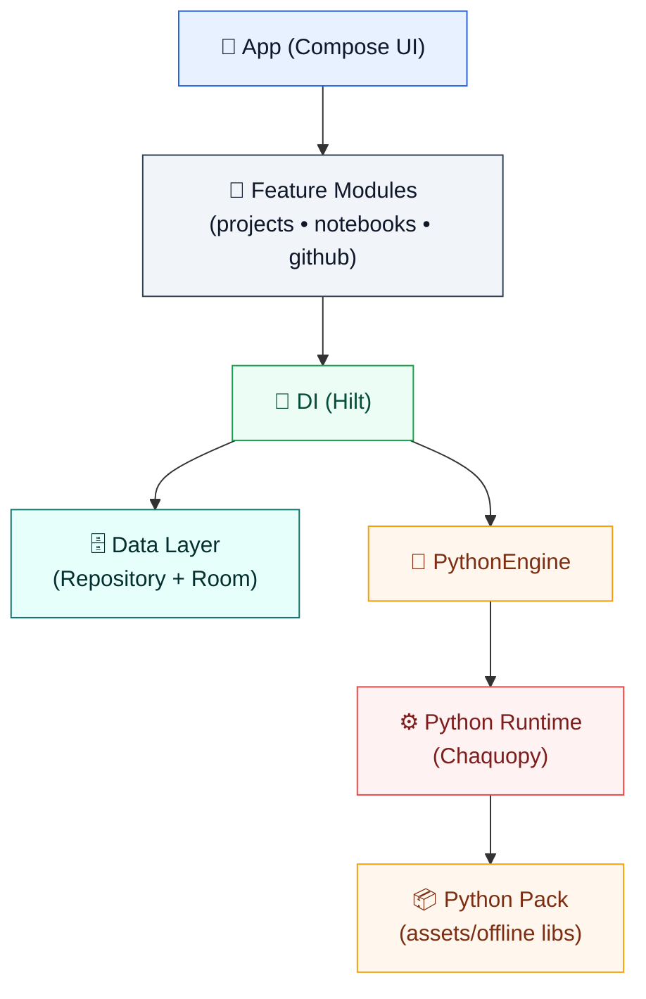

# BloquinhoPy — Python Notebook IDE for Android

**Language:** English | [Português 🇧🇷](./README.pt-BR.md)

[](https://github.com/bcmaymonegalvao/bloquinho-python/actions)

BloquinhoPy is an **offline-first** Python IDE for Android focused on a simple notebook experience (`.ipynb`). It ships with an embedded Python runtime and a curated scientific stack for mobile devices.

## 🎯 MVP goals

- ✅ **Phase&nbsp;1 – Core engine:** Hilt DI, Room database, PythonEngine.
- ✅ **Phase&nbsp;2 – UI integration:** Jetpack Compose, Navigation, ViewModels.
- ✅ **Phase&nbsp;3 – Advanced features:** Python execution, error handling, theming and logging.

## 🏗️ Architecture

### Project structure


### Application architecture (layered package structure)

```text
├── 💉 di/                     # Dependency injection modules (Hilt)
│   ├── DatabaseModule.kt     # Room database configuration
│   └── EngineModule.kt       # PythonEngine singleton provider
├── 📊 data/                   # Data layer
│   ├── 💾 local/              # Local sources (Room)
│   │   ├── database/         # Room database setup
│   │   ├── dao/              # Data Access Objects
│   │   └── entities/         # Room entities
│   ├── 📦 repository/         # Repository pattern
│   └── 📄 model/              # Data models / DTOs
├── 🐍 engine/                 # Python execution engine
│   └── PythonEngine.kt       # Chaquopy integration
├── 🎨 ui/                     # UI layer (Jetpack Compose)
│   ├── 🧭 navigation/         # Navigation graph/routes
│   ├── 📁 project/            # Project list & management screens
│   ├── 📓 notebook/           # Notebook editor/execution screens
│   ├── 🎭 theme/              # Material&nbsp;3 theme
│   └── 🧩 components/         # Reusable UI components
├── 🛠️ util/                   # Utilities & helpers
│   └── Logger.kt             # Logging & custom exceptions
├── 🚀 BloquinhoApplication.kt  # Application class (Hilt setup)
└── 🏠 MainActivity.kt         # App entry point
```

This high-level overview reflects the Kotlin module layout used in the `app/src/main/java` namespace. Additional Gradle modules such as `core/`, `runtime-python/`, `feature-github/`, `feature-notebooks/` and `feature-projects/` live alongside `app/` and follow a similar internal structure. See the [project tree](docs/ARCHITECTURE.md) for details.

## Repository structure

The root of this repository contains multiple Gradle modules and supporting files. The following tree (generated using find) shows the top‑level layout of the project. Directories and important files are annotated with emojis to hint at their purpose:

```
📦 bloquinhopy-android-scaffold/
├── ⚙️ .editorconfig
├── 🙈 .gitignore
├── 🐙 .github/
│   ├── 🧩 ISSUE_TEMPLATE/
│   │   ├── 🐛 bug_report.md
│   │   └── ✨ feature_request.md
│   └── 🤖 workflows/
│       └── ✅ ci.yml
│
├── 📱 app/
│   ├── 🧱 build.gradle.kts
│   └── 📁 src/main/
│       ├── 🤖 AndroidManifest.xml
│       ├── ☕ java/
│       │   └── 📦 io/github/bcmaymonegalvao/
│       │       └── 📄 BloquinhoApplication.kt
│       └── 🎨 res/
│           └── 🏷️ values/
│               ├── 📝 strings.xml
│               └── 🎨 themes.xml
│
├── 🧩 core/
│   ├── 🧱 build.gradle.kts
│   └── ☕ src/main/java/                  # (sem arquivos encontrados no maxdepth atual)
│
├── 🧩 feature-github/
│   ├── 🧱 build.gradle.kts
│   └── ☕ src/main/java/
│       └── 📦 io/github/...
│
├── 🧩 feature-notebooks/
│   ├── 🧱 build.gradle.kts
│   └── ☕ src/main/java/
│       └── 📦 io/github/...
│
├── 🧩 feature-projects/
│   ├── 🧱 build.gradle.kts
│   └── ☕ src/main/java/
│       └── 📦 io/github/...
│
├── 🐍 python-pack/
│   ├── 🧱 build.gradle.kts
│   └── 🗃️ src/main/assets/
│       └── 🧷 .keep
│
├── 🐍⚙️ runtime-python/
│   ├── 🧱 build.gradle.kts
│   └── 📁 src/main/                       # (sem arquivos encontrados no maxdepth atual)
│
├── 📚 docs/
│   ├── 🧭 ARCHITECTURE.md
│   ├── 📌 PRD.md
│   ├── 🗺️ ROADMAP.md
│   ├── 🧠 adr/
│   │   ├── ADR-0001-python-runtime-chaquopy.md
│   │   ├── ADR-0002-notebook-engine-no-jupyter-server.md
│   │   ├── ADR-0003-abi-arm64-only.md
│   │   ├── ADR-0004-distribution-play-asset-delivery.md
│   │   ├── ADR-0005-packages-install-policy.md
│   │   └── ADR-0006-streamlit-local-webview.md
│   └── 🧪 examples/
│       └── hello_notebook.ipynb
│
├── 🧱 gradle/
│   ├── 🧾 libs.versions.toml
│   └── 🧰 wrapper/
│       └── gradle-wrapper.properties
│
├── 🛠️ scripts/
│   └── 🚀 init_repo.sh
│
├── 🧱 build.gradle.kts
├── 🧱 settings.gradle.kts
├── 🧰 gradlew
├── 🧰 gradlew.bat
│
├── 📝 CHANGELOG.md
├── 🤝 CONTRIBUTING.md
├── 🫶 CODE_OF_CONDUCT.md
├── 🔐 SECURITY.md
├── 📄 LICENSE
├── 📘 README.md
└── 📗 README.pt-BR.md
```

## 🔧 Technologies

- **Language:** Kotlin
- **UI framework:** Jetpack Compose
- **Database:** Room
- **Dependency injection:** Hilt
- **Navigation:** Compose Navigation
- **Async:** Coroutines & Flow
- **Python runtime:** Chaquopy (for embedded Python execution)
- **Build tool:** Gradle 8.7
- **CI/CD:** GitHub Actions

## 📦 Key components

1. **PythonEngine** (`engine/PythonEngine.kt`)
   
   Handles Python code execution. The current implementation uses a mock evaluator and is ready for Chaquopy integration. Each run returns an `ExecutionResult` containing the standard output, any error messages and execution time.

2. **Logger & error handling** (`util/Logger.kt`)

   Provides a unified logging system with different log levels and custom exception types to improve error handling. Exceptions are categorised into database, execution, validation and not-found errors.

3. **Material 3 theme** (`ui/theme/`)

   Defines the app’s light and dark colour schemes and custom typography. Brand colours are based on a teal palette.

4. **Data layer** (`data/`)

   - **Entities:** `ProjectEntity`, `NotebookEntity` with relationships.
   - **DAOs:** `ProjectDao`, `NotebookDao` for CRUD operations.
   - **Repository:** `BloquinhoRepository` providing a unified API for accessing local data.
   - **Database:** `AppDatabase` Room implementation.

5. **UI screens**

   - **ProjectListScreen:** Display and create projects.
   - **NotebookScreen:** Edit notebooks and run Python code.
   - **Navigation:** Built with Jetpack Compose navigation and typed arguments.

## 🚀 Getting started

### Prerequisites

Ensure you have the following installed:

- Android SDK 34+
- JDK 17+
- Gradle 8.7+

### Build & run

Run the following commands from a terminal to build, install and test BloquinhoPy:

```bash
# Clone repository
git clone https://github.com/bcmaymonegalvao/bloquinho-python.git
cd bloquinho-python

# Build debug APK
./gradlew assembleDebug

# Install on device/emulator
./gradlew installDebug

# Run tests
./gradlew test
```

## 📋 Roadmap & status

### Completed

- ✅ Chaquopy Python execution integrated
- ✅ `.ipynb` serialization/deserialization with `NotebookSerializer`
- ✅ Notebook save/load via `NotebookViewModel`
- ✅ Error handling for Python code
- ✅ CI/CD workflow operational
- ✅ Database layer complete with entities and DAOs
- ✅ Multi-language support (English/Portuguese)

### In progress

- 🚧 File import/export UI
- 🚧 Performance optimisation
- 🚧 Extended Python library support
- 🚧 Project collaboration features (basic)
- 🚧 Package marketplace
- 🚧 Cloud sync (Firebase)
- 🚧 Documentation website

For a detailed timeline of future releases (alpha, beta and production) see [docs/ROADMAP.md](docs/ROADMAP.md).

## 📦 GitHub Releases Distribution

BloquinhoPy is distributed via **GitHub Releases** instead of the Play Store. This allows direct APK distribution without app store review process.

### How to get BloquinhoPy

1. Visit the [Releases page](https://github.com/bcmaymonegalvao/bloquinho-python/releases)
2. Download the latest `app-release.apk`
3. Transfer to your Android device
4. Enable "Install from Unknown Sources" in Settings > Security
5. Tap the APK file and follow the installation prompts

### System Requirements
- Android 8.0 (API 26) or higher
- 100MB free storage space
- 2GB RAM minimum

### Build APK from Source

For developers interested in building the latest development version:

```bash
# Clone the repository
git clone https://github.com/bcmaymonegalvao/bloquinho-python.git
cd bloquinho-python

# Build debug APK
./gradlew assembleDebug

# Install on device
./gradlew installDebug
```

For detailed release workflow and setup instructions, see [RELEASES_SETUP.md](RELEASES_SETUP.md).


**Phase 6: Beta release** (planned) – Focus on performance optimisation, UI/UX polish and security. Distribution via Firebase App Distribution.

**Phase 7: Production release** (planned) – Create Play Store listing, marketing materials, privacy policy and complete final testing for approval.

## 🧪 Alpha testing

You can test BloquinhoPy on your smartphone by building from source:

1. Clone the repository and open it in Android Studio (Hedgehog or later).
2. Sync Gradle and build the project.
3. Run on your device or emulator.
4. Create new cells and execute Python code (e.g. `print("Hello")`, `2 + 2`).
5. Check that outputs appear correctly and verify that invalid code triggers appropriate error messages.

### Known limitations

- 🚧 `.ipynb` file save/load UI not yet implemented (low-level functions exist in the ViewModel).
- 🚧 Limited Python standard library (Chaquopy constraints).
- 🚧 External package installation is not yet supported.

---

MIT – see the [LICENSE](LICENSE) file for details.

## 👨‍💻 Author

**Bruno César Maymone Galvão** – Senior Developer & ML Engineer

- GitHub: [@bcmaymonegalvao](https://github.com/bcmaymonegalvao)
- Focus: Python, machine learning and full-stack development.

---

BloquinhoPy — making Python development accessible on Android 📱✨
